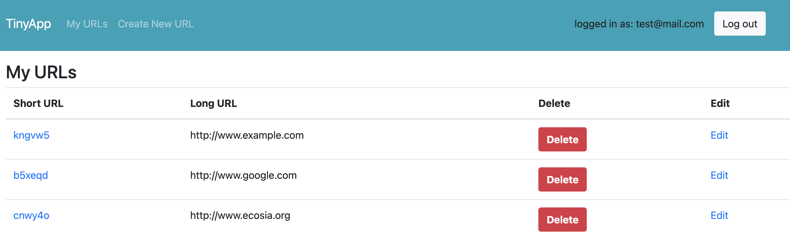

# TinyApp Project 🔗

This project was done as part of the coursework in the Lighthouse Labs Web Development bootcamp.

TinyApp is a full stack web application built with Node and Express that allows users to shorten long URLs (like bit.ly). For optimal functionality, you should manually clear existing cookies from Chrome before using the app.

## Dependencies 🤖

- Node.js
- Express
- EJS
- bcrypt
- body-parser
- cookie-session

## Getting Started 💡

- Install all dependencies (using the `npm install` command).
- Run the development web server using the `node express_server.js` command.

## Future improvements & To-dos 📝

- Implement cookie expiry after 24 hours
- custom error pages
